# System Architecture

**Last Updated**: October 27, 2025

## Overview

The RCA Insight Engine follows a layered architecture with clear separation of concerns. This diagram shows the major components and their interactions.

## Architecture Diagram

```mermaid
graph TB
    subgraph "Presentation Layer"
        UI[Next.js Frontend<br/>React + TypeScript<br/>Port 3000]
    end

    subgraph "API Layer"
        API[FastAPI Application<br/>REST + SSE Endpoints<br/>Port 8000]
        Auth[Authentication<br/>JWT Tokens]
        Files[File Upload Handler]
        Jobs[Job Management]
        Tickets[ITSM Integration]
        SSE[Server-Sent Events<br/>Progress Streaming]
    end

    subgraph "Worker Layer"
        Worker[Async Job Processor<br/>Background Tasks]
        Ingest[File Ingestion<br/>Chunking + Parsing]
        PII[PII Redaction<br/>Multi-pass Scanner]
        Embed[Embedding Generation<br/>Vector Creation]
        LLMOrch[LLM Orchestrator<br/>Analysis Engine]
        Reporter[Report Generator<br/>Markdown/HTML/JSON]
    end

    subgraph "Data Layer"
        PG[(PostgreSQL<br/>+pgvector<br/>Port 15432)]
        Redis[(Redis Cache<br/>Optional<br/>Port 16379)]
    end

    subgraph "LLM Providers"
        Copilot[GitHub Copilot<br/>via Proxy]
        OpenAI[OpenAI GPT]
        Anthropic[Anthropic Claude]
        Bedrock[AWS Bedrock]
        Ollama[Ollama<br/>Local LLM]
        vLLM[vLLM Server]
    end

    subgraph "ITSM Systems"
        ServiceNow[ServiceNow<br/>Ticket Creation]
        Jira[Jira<br/>Issue Tracking]
    end

    subgraph "Monitoring"
        Prometheus[Prometheus<br/>Metrics Collection]
        Grafana[Grafana<br/>Dashboards]
        Logs[Structured Logging<br/>JSON Format]
    end

    %% User Interactions
    User((User)) --> UI
    UI <-->|HTTP/WebSocket| API
    
    %% API Layer Connections
    API --> Auth
    API --> Files
    API --> Jobs
    API --> Tickets
    API --> SSE
    
    %% Worker Connections
    API -->|Enqueue Jobs| Worker
    Worker --> Ingest
    Worker --> PII
    Worker --> Embed
    Worker --> LLMOrch
    Worker --> Reporter
    
    %% Data Layer
    API <--> PG
    Worker <--> PG
    API <-.->|Optional| Redis
    Worker <-.->|Cache| Redis
    
    %% LLM Integration
    LLMOrch --> Copilot
    LLMOrch --> OpenAI
    LLMOrch --> Anthropic
    LLMOrch --> Bedrock
    LLMOrch --> Ollama
    LLMOrch --> vLLM
    
    %% ITSM Integration
    Tickets --> ServiceNow
    Tickets --> Jira
    
    %% Monitoring
    API -.->|Metrics| Prometheus
    Worker -.->|Metrics| Prometheus
    Prometheus --> Grafana
    API -.->|Logs| Logs
    Worker -.->|Logs| Logs
    
    %% SSE Streaming
    Worker -->|Progress Events| SSE
    SSE -->|Real-time Updates| UI

    %% Styling
    classDef frontend fill:#61dafb,stroke:#333,stroke-width:2px,color:#000
    classDef backend fill:#009688,stroke:#333,stroke-width:2px,color:#fff
    classDef worker fill:#ff9800,stroke:#333,stroke-width:2px,color:#000
    classDef data fill:#4caf50,stroke:#333,stroke-width:2px,color:#fff
    classDef external fill:#9c27b0,stroke:#333,stroke-width:2px,color:#fff
    classDef monitoring fill:#607d8b,stroke:#333,stroke-width:2px,color:#fff

    class UI frontend
    class API,Auth,Files,Jobs,Tickets,SSE backend
    class Worker,Ingest,PII,Embed,LLMOrch,Reporter worker
    class PG,Redis data
    class Copilot,OpenAI,Anthropic,Bedrock,Ollama,vLLM,ServiceNow,Jira external
    class Prometheus,Grafana,Logs monitoring
```

## Component Descriptions

### Presentation Layer
- **Next.js Frontend**: React-based UI with TypeScript, Tailwind CSS, and real-time SSE updates
- Handles file uploads, job monitoring, and investigation visualization

### API Layer
- **FastAPI Application**: Async REST API with OpenAPI documentation
- **Authentication**: JWT-based authentication with access and refresh tokens
- **File Upload Handler**: Multipart upload with validation and storage
- **Job Management**: CRUD operations for investigation jobs
- **ITSM Integration**: Ticket creation for ServiceNow and Jira
- **SSE Streaming**: Real-time progress updates to connected clients

### Worker Layer
- **Async Job Processor**: Background task executor for CPU/IO-bound operations
- **File Ingestion**: Text extraction, chunking, and parsing
- **PII Redaction**: Multi-pass scanner with 30+ pattern types and validation
- **Embedding Generation**: Vector creation for semantic search (via LLM providers)
- **LLM Orchestrator**: Coordinates retrieval, context building, and LLM queries
- **Report Generator**: Produces Markdown, HTML, and JSON outputs

### Data Layer
- **PostgreSQL + pgvector**: Primary database with vector similarity search
- **Redis**: Optional caching layer for sessions and rate limiting

### LLM Providers
Multi-provider support with runtime selection:
- **GitHub Copilot**: Via local proxy server
- **OpenAI**: GPT-3.5, GPT-4, GPT-4o models
- **Anthropic**: Claude 3 models (Haiku, Sonnet, Opus)
- **AWS Bedrock**: Claude and other models via AWS
- **Ollama**: Self-hosted local LLM runtime
- **vLLM**: High-performance inference server

### ITSM Systems
- **ServiceNow**: Incident and problem ticket creation
- **Jira**: Issue creation with custom field mapping

### Monitoring
- **Prometheus**: Metrics collection (job durations, LLM calls, errors)
- **Grafana**: Visualization dashboards (optional)
- **Structured Logging**: JSON-formatted logs with request correlation

## Data Flow Summary

1. **User uploads files** via UI → API stores metadata and files
2. **API enqueues job** → Worker picks up task
3. **Worker processes**:
   - Extracts text and chunks content
   - Redacts PII (multi-pass)
   - Generates embeddings and stores vectors
   - Retrieves relevant context for analysis
   - Sends queries to LLM provider
   - Generates structured report
4. **Worker emits progress events** → API streams to UI via SSE
5. **Job completes** → Optional ticket creation in ITSM system
6. **Metrics recorded** → Prometheus/Grafana for monitoring

## Technology Highlights

- **Async-first**: All I/O operations use asyncio for performance
- **Type-safe**: Pydantic models for validation, TypeScript on frontend
- **Security**: Multi-layer PII redaction, JWT authentication, HTTPS-ready
- **Scalable**: Worker can run on separate instances, Redis for distributed caching
- **Observable**: Prometheus metrics, structured logs, health check endpoints

## Related Diagrams

- [Data Flow](data-flow.md) - Detailed sequence diagrams
- [Deployment Topology](deployment.md) - Infrastructure setup
- [PII Pipeline](pii-pipeline.md) - Security workflow
- [ITSM Integration](itsm-integration.md) - Ticket creation flows
