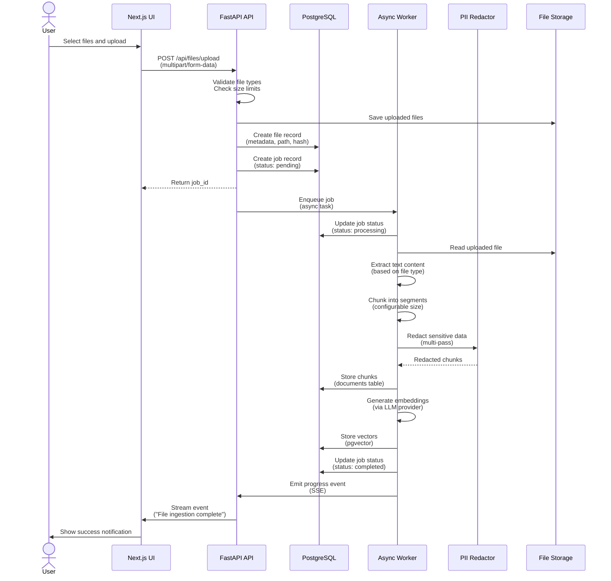
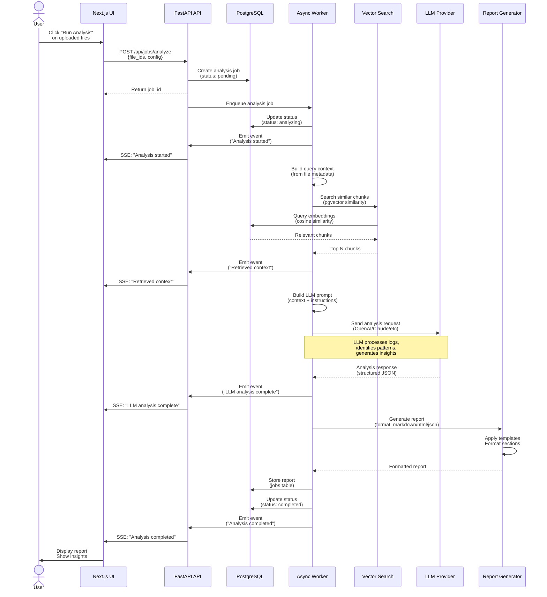
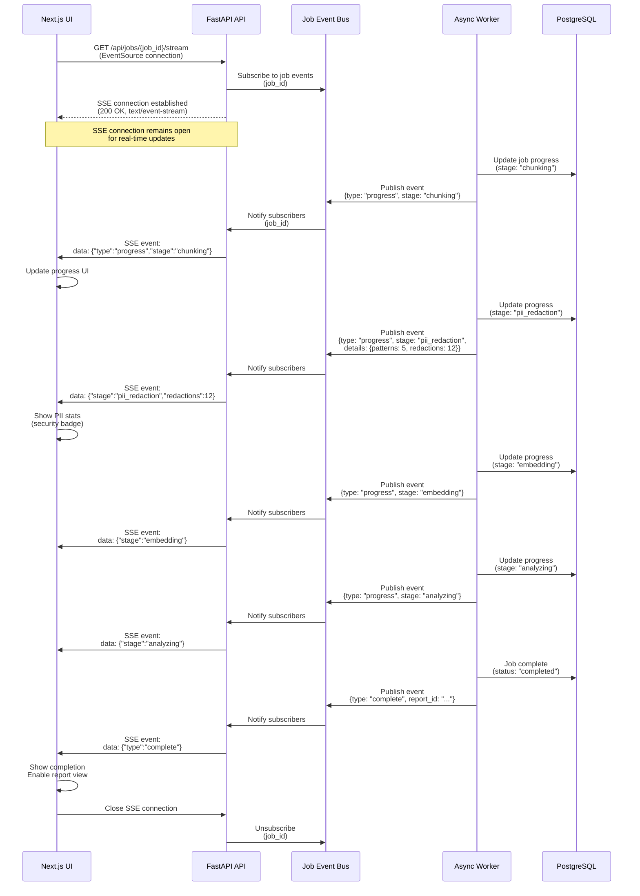
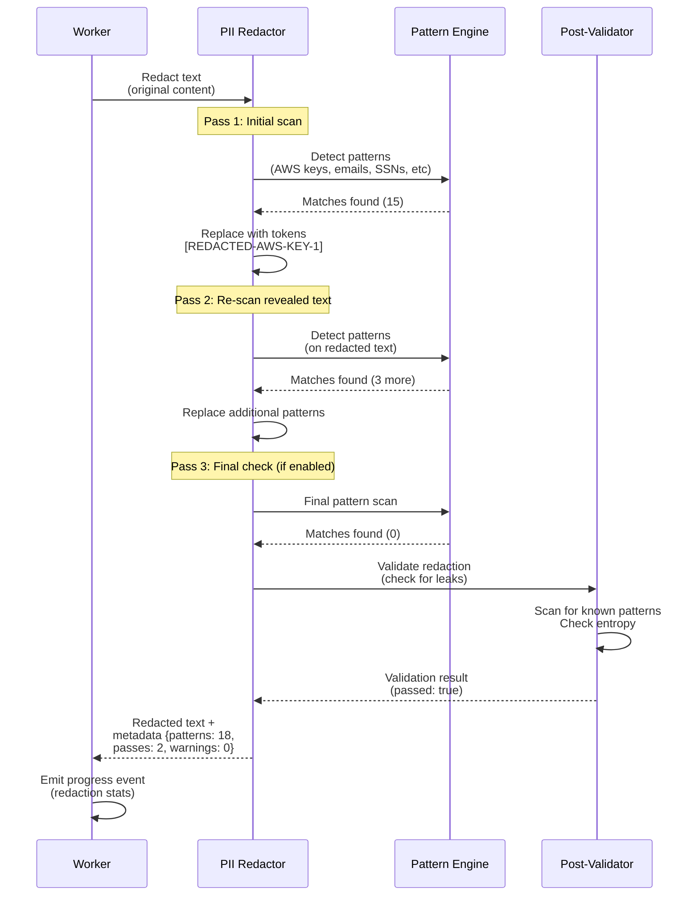

# Data Flow Diagrams

**Last Updated**: October 27, 2025

## Overview

This document contains sequence diagrams showing how data flows through the RCA Engine for different operations.

## 1. File Upload and Ingestion Flow

## 2. Analysis Request Flow

## 3. Real-Time Progress Streaming (SSE)

## 4. PII Redaction Workflow (Simplified)

## Key Observations

### Upload Flow
- Files are validated before storage
- Jobs are created immediately for tracking
- Worker processes asynchronously (no blocking)
- Progress events stream to UI in real-time

### Analysis Flow
- Vector similarity search finds relevant context
- LLM provider is configurable per job
- Reports support multiple formats (Markdown, HTML, JSON)
- All stages emit progress events

### SSE Streaming
- Single persistent connection per job
- Events published by worker, consumed by API, streamed to UI
- Enables real-time progress visibility
- Connection closed when job completes

### PII Redaction
- Multi-pass approach catches nested patterns
- Post-validation ensures no leaks
- Metadata tracks redaction statistics
- Configurable number of passes (1-3)

## Related Diagrams

- [System Architecture](architecture.md) - Component overview
- [PII Pipeline](pii-pipeline.md) - Detailed PII redaction flow
- [Deployment Topology](deployment.md) - Infrastructure setup
