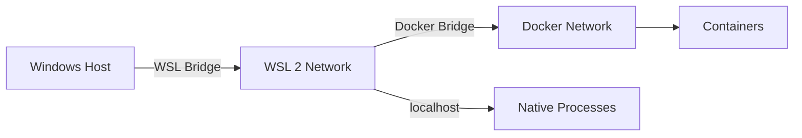

# Deployment Topology

**Last Updated**: October 27, 2025

## Overview

The RCA Engine is designed to run in a **WSL 2 + Docker Engine** environment on Windows, specifically avoiding Docker Desktop due to enterprise firewall restrictions.

## Deployment Architecture

```mermaid
graph TB
    subgraph "Windows Host"
        Browser[Web Browser<br/>localhost:3000]
        WSLCmd[WSL Command<br/>wsl.exe]
    end

    subgraph "WSL 2 (Ubuntu/Debian)"
        subgraph "Docker Engine"
            subgraph "Docker Compose Stack"
                DB[PostgreSQL Container<br/>+ pgvector extension<br/>Internal: 5432<br/>Mapped: 15432]
                RedisC[Redis Container<br/>Optional Cache<br/>Internal: 6379<br/>Mapped: 16379]
            end
            
            subgraph "Optional Monitoring"
                PromC[Prometheus Container<br/>Port: 9090]
                GrafanaC[Grafana Container<br/>Port: 3001]
            end
        end
        
        subgraph "Native Processes (WSL)"
            API[FastAPI Backend<br/>Python 3.11+<br/>Port: 8000<br/>uvicorn --reload]
            Worker[Async Worker<br/>Background Jobs<br/>Celery alternative]
            CopilotProxy[Copilot Proxy<br/>Optional<br/>Port: 8001]
        end
        
        subgraph "File System"
            CodeRepo[/mnt/c/.../RCA-Final<br/>Source Code]
            Uploads[uploads/<br/>User Files]
            Logs[local-logs/<br/>Application Logs]
            DBVolume[(Docker Volume<br/>postgres_data)]
            RedisVolume[(Docker Volume<br/>redis_data)]
        end
        
        DockerEngine[Docker Engine<br/>NOT Docker Desktop]
    end

    subgraph "External Services"
        LLMCloud[LLM Providers<br/>OpenAI, Anthropic<br/>AWS Bedrock]
        ITSMCloud[ITSM Systems<br/>ServiceNow, Jira]
        LocalLLM[Local LLM<br/>Ollama on host<br/>Port: 11434]
    end

    %% Connections
    Browser -->|HTTP| API
    Browser -->|WebSocket/SSE| API
    WSLCmd -->|Manages| DockerEngine
    
    DockerEngine --> DB
    DockerEngine --> RedisC
    DockerEngine -.->|Optional| PromC
    DockerEngine -.->|Optional| GrafanaC
    
    API --> DB
    API -.->|Cache| RedisC
    Worker --> DB
    Worker -.->|Cache| RedisC
    
    API --> Uploads
    Worker --> Uploads
    API --> Logs
    Worker --> Logs
    
    DB --> DBVolume
    RedisC --> RedisVolume
    
    Worker -->|HTTPS| LLMCloud
    Worker -->|HTTPS| ITSMCloud
    Worker -.->|HTTP| LocalLLM
    Worker -.->|HTTP| CopilotProxy
    
    API -.->|Metrics| PromC
    Worker -.->|Metrics| PromC
    PromC -.->|Data Source| GrafanaC

    %% Styling
    classDef windows fill:#0078d4,stroke:#333,stroke-width:2px,color:#fff
    classDef wsl fill:#ff6600,stroke:#333,stroke-width:2px,color:#fff
    classDef container fill:#2496ed,stroke:#333,stroke-width:2px,color:#fff
    classDef process fill:#00a82d,stroke:#333,stroke-width:2px,color:#fff
    classDef storage fill:#ffa500,stroke:#333,stroke-width:2px,color:#000
    classDef external fill:#9c27b0,stroke:#333,stroke-width:2px,color:#fff

    class Browser,WSLCmd windows
    class DockerEngine wsl
    class DB,RedisC,PromC,GrafanaC container
    class API,Worker,CopilotProxy process
    class CodeRepo,Uploads,Logs,DBVolume,RedisVolume storage
    class LLMCloud,ITSMCloud,LocalLLM external
```

## Network Configuration

### Port Mappings

| Service | Internal Port | Mapped Port | Access From |
|---------|--------------|-------------|-------------|
| PostgreSQL | 5432 | 15432 | WSL, Windows |
| Redis | 6379 | 16379 | WSL, Windows |
| FastAPI | 8000 | 8000 | Windows Browser |
| Next.js UI | 3000 | 3000 | Windows Browser |
| Copilot Proxy | 8001 | 8001 | WSL (API/Worker) |
| Prometheus | 9090 | 9090 | Windows Browser (optional) |
| Grafana | 3001 | 3001 | Windows Browser (optional) |
| Ollama | 11434 | 11434 | WSL (Worker) |

### Network Flow



## Container Configuration

### docker-compose.dev.yml

```yaml
services:
  postgres:
    image: pgvector/pgvector:pg15
    ports:
      - "15432:5432"
    environment:
      POSTGRES_DB: rca_db
      POSTGRES_USER: rca_user
      POSTGRES_PASSWORD: rca_password
    volumes:
      - postgres_data:/var/lib/postgresql/data
    healthcheck:
      test: ["CMD-SHELL", "pg_isready -U rca_user"]
      interval: 10s
      timeout: 5s
      retries: 5

  redis:
    image: redis:7-alpine
    ports:
      - "16379:6379"
    volumes:
      - redis_data:/data
    command: redis-server --appendonly yes
```

## Startup Sequence

### Automated Startup (Recommended)

```powershell
# From Windows PowerShell (repository root)
.\quick-start-dev.ps1
```

This script:
1. Starts Docker containers via `wsl.exe -e docker compose up -d`
2. Waits for database health check
3. Runs Alembic migrations
4. Starts FastAPI backend with Uvicorn (hot reload)
5. Starts Next.js UI development server
6. Optionally starts async worker
7. Optionally starts Copilot proxy server

### Manual Startup

```powershell
# 1. Start Docker services (from Windows)
wsl.exe -e docker compose -f docker-compose.dev.yml up -d

# 2. Verify containers running
wsl.exe -e docker ps

# 3. Activate Python venv (in WSL or Windows)
.\venv\Scripts\activate

# 4. Run migrations
alembic upgrade head

# 5. Start FastAPI (in separate terminal)
python -m uvicorn apps.api.main:app --host 0.0.0.0 --port 8000 --reload

# 6. Start Worker (in separate terminal)
python -m apps.worker.main

# 7. Start Next.js UI (in separate terminal)
cd ui
npm run dev
```

## Critical Requirements

### ⚠️ Docker Engine in WSL (NOT Docker Desktop)

**Why**: Docker Desktop is typically blocked in enterprise environments due to licensing or firewall restrictions.

**Verification**:
```powershell
# From Windows PowerShell
wsl.exe -e docker ps
# Should show running containers
```

**If Docker not installed in WSL**:
```bash
# Inside WSL terminal
curl -fsSL https://get.docker.com -o get-docker.sh
sudo sh get-docker.sh
sudo usermod -aG docker $USER
# Log out and back in
sudo service docker start
```

### Environment Variables

**Location**: `.env` file in repository root

**Key Variables**:
```bash
# Database
POSTGRES_HOST=localhost
POSTGRES_PORT=15432
POSTGRES_USER=rca_user
POSTGRES_PASSWORD=rca_password
POSTGRES_DB=rca_db

# Redis
REDIS_HOST=localhost
REDIS_PORT=16379

# API
API_HOST=0.0.0.0
API_PORT=8000

# LLM Providers (configure as needed)
OPENAI_API_KEY=sk-...
ANTHROPIC_API_KEY=sk-ant-...
```

## Production Deployment

### Deployment Options

1. **All-in-Docker** (Recommended for production)
   - Containerize FastAPI, Worker, and UI
   - Use Docker Compose or Kubernetes
   - Separate database and Redis instances

2. **Hybrid** (Development/Testing)
   - Docker for databases
   - Native processes for app services (hot reload)

3. **Cloud-Native** (Scalable)
   - Managed PostgreSQL (AWS RDS, Azure Database)
   - Managed Redis (ElastiCache, Azure Cache)
   - Container orchestration (ECS, AKS, GKE)
   - Load balancer for API
   - Separate worker instances

### Production Checklist

- [ ] Use production-grade database (not Docker container)
- [ ] Enable HTTPS/TLS (reverse proxy: nginx, Traefik)
- [ ] Configure firewall rules (restrict database ports)
- [ ] Set up backup and monitoring
- [ ] Use secret management (AWS Secrets Manager, Azure Key Vault)
- [ ] Enable Prometheus metrics collection
- [ ] Configure log aggregation (ELK, CloudWatch)
- [ ] Set up health check endpoints
- [ ] Configure rate limiting
- [ ] Enable CORS restrictions

## Troubleshooting

### Common Issues

**Docker not starting in WSL**:
```bash
sudo service docker start
sudo service docker status
```

**Port already in use**:
```powershell
# Check what's using port 8000
netstat -ano | findstr :8000
# Stop conflicting process or change port
```

**Cannot connect to PostgreSQL**:
```bash
# Verify container running
wsl.exe -e docker ps --filter name=postgres

# Check logs
wsl.exe -e docker logs rca-final-postgres-1

# Test connection
psql -h localhost -p 15432 -U rca_user -d rca_db
```

**Database migration fails**:
```bash
# Reset database (⚠️ loses all data)
wsl.exe -e docker compose down -v
wsl.exe -e docker compose up -d
alembic upgrade head
```

## Related Documentation

- [Developer Setup Guide](../getting-started/dev-setup.md)
- [Deployment Guide](../deployment/deployment-guide.md)
- [Troubleshooting Playbook](../operations/troubleshooting.md)
- [System Architecture](architecture.md)
