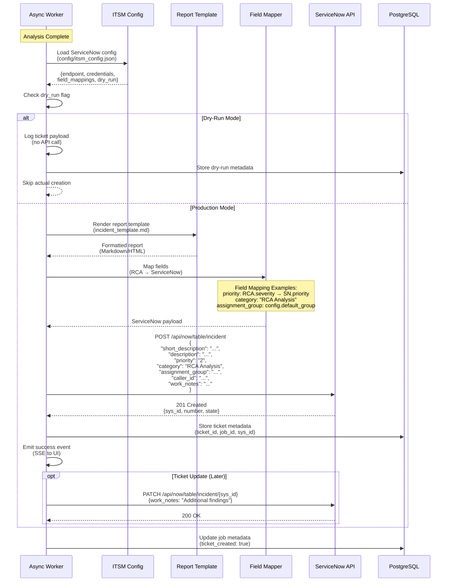
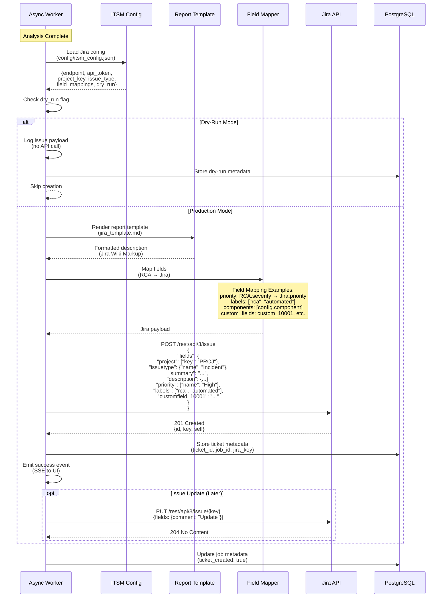
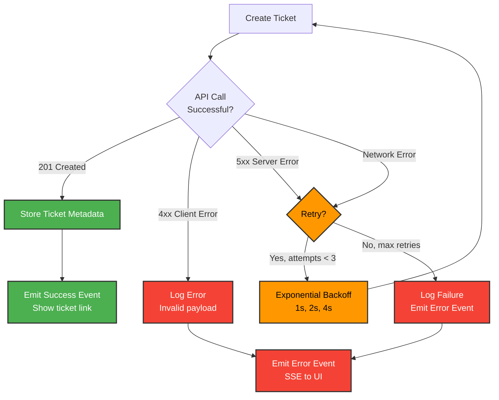

# ITSM Integration Workflows

**Last Updated**: October 27, 2025

## Overview

The RCA Engine integrates with ITSM (IT Service Management) platforms to automatically create tickets after analysis completion. Currently supported: **ServiceNow** and **Jira**.

## ServiceNow Integration Flow



## Jira Integration Flow



## Field Mapping Architecture

```mermaid
graph TB
    subgraph "RCA Analysis Output"
        JobData[Job Metadata<br/>- severity<br/>- affected_systems<br/>- error_count<br/>- analysis_summary]
        Report[Generated Report<br/>- Markdown/HTML<br/>- Structured sections<br/>- Recommendations]
    end

    subgraph "ITSM Config (config/itsm_config.json)"
        Mappings[Field Mappings<br/>- Default values<br/>- Transformation rules<br/>- Custom fields]
        Templates[Templates<br/>- ServiceNow format<br/>- Jira Wiki format]
        Settings[Settings<br/>- Dry-run mode<br/>- Assignment rules<br/>- Priority mapping]
    end

    subgraph "Field Mapper"
        Transform[Field Transformer<br/>- Apply mappings<br/>- Format conversions<br/>- Validation]
    end

    subgraph "ITSM Platform"
        SNFields[ServiceNow Fields<br/>- short_description<br/>- description<br/>- priority (1-5)<br/>- category<br/>- assignment_group<br/>- work_notes]
        
        JiraFields[Jira Fields<br/>- summary<br/>- description (ADF)<br/>- priority<br/>- labels<br/>- components<br/>- customfield_*]
    end

    JobData --> Transform
    Report --> Transform
    Mappings --> Transform
    Templates --> Transform
    
    Transform -->|ServiceNow Format| SNFields
    Transform -->|Jira Format| JiraFields

    %% Styling
    classDef rca fill:#4caf50,stroke:#333,stroke-width:2px,color:#fff
    classDef config fill:#ff9800,stroke:#333,stroke-width:2px,color:#000
    classDef mapper fill:#2196f3,stroke:#333,stroke-width:2px,color:#fff
    classDef itsm fill:#9c27b0,stroke:#333,stroke-width:2px,color:#fff

    class JobData,Report rca
    class Mappings,Templates,Settings config
    class Transform mapper
    class SNFields,JiraFields itsm
```

## Configuration Example

### config/itsm_config.json

```json
{
  "servicenow": {
    "enabled": true,
    "dry_run": false,
    "endpoint": "https://instance.service-now.com",
    "username": "integration_user",
    "password": "${SERVICENOW_PASSWORD}",
    "defaults": {
      "category": "RCA Analysis",
      "assignment_group": "DevOps Team",
      "caller_id": "rca.engine@company.com"
    },
    "field_mappings": {
      "priority": {
        "critical": "1",
        "high": "2",
        "medium": "3",
        "low": "4"
      }
    }
  },
  "jira": {
    "enabled": true,
    "dry_run": false,
    "endpoint": "https://company.atlassian.net",
    "email": "integration@company.com",
    "api_token": "${JIRA_API_TOKEN}",
    "project_key": "OPS",
    "issue_type": "Incident",
    "defaults": {
      "labels": ["rca", "automated"],
      "component": "Platform"
    },
    "field_mappings": {
      "priority": {
        "critical": "Highest",
        "high": "High",
        "medium": "Medium",
        "low": "Low"
      },
      "custom_fields": {
        "rca_job_id": "customfield_10001",
        "affected_systems": "customfield_10002"
      }
    }
  }
}
```

## Dry-Run Mode

### Purpose
Test ticket creation without actually creating tickets in ITSM systems.

### Behavior
```python
if config.dry_run:
    logger.info(f"DRY-RUN: Would create ticket with payload: {payload}")
    emit_event("ticket-dry-run", payload)
    return {"success": True, "dry_run": True, "payload": payload}
else:
    response = itsm_api.create_ticket(payload)
    return {"success": True, "ticket_id": response.id}
```

### Use Cases
- **Development/Testing**: Verify integration without polluting production ITSM
- **Configuration Validation**: Test field mappings before enabling
- **Approval Workflow**: Review ticket content before auto-creation

## Priority Mapping

### RCA Severity → ITSM Priority

| RCA Severity | ServiceNow Priority | Jira Priority | Description |
|--------------|---------------------|---------------|-------------|
| Critical | 1 - Critical | Highest | System outage, multiple services down |
| High | 2 - High | High | Major functionality impaired |
| Medium | 3 - Medium | Medium | Degraded performance, workaround exists |
| Low | 4 - Low | Low | Minor issues, informational |

## Template Rendering

### ServiceNow Template (incident_template.md)

```markdown
# Incident: {job.title}

## Summary
{analysis.executive_summary}

## Affected Systems
{analysis.affected_systems}

## Timeline
{analysis.timeline}

## Root Cause
{analysis.root_cause}

## Recommendations
{analysis.recommendations}

## Technical Details
{analysis.technical_details}

---
*Generated by RCA Engine - Job ID: {job.id}*
```

### Jira Template (Atlassian Document Format)

```json
{
  "type": "doc",
  "version": 1,
  "content": [
    {
      "type": "heading",
      "attrs": {"level": 2},
      "content": [{"type": "text", "text": "Summary"}]
    },
    {
      "type": "paragraph",
      "content": [{"type": "text", "text": "{analysis.executive_summary}"}]
    },
    ...
  ]
}
```

## Error Handling

### API Failures



### Retry Policy

- **Max Retries**: 3 attempts
- **Backoff**: Exponential (1s, 2s, 4s)
- **Retryable Errors**: 5xx, network timeouts
- **Non-Retryable**: 4xx client errors (bad payload)

## Security Considerations

### Credential Storage

- **Environment Variables**: Store API tokens/passwords in `.env`
- **Secret Managers**: AWS Secrets Manager, Azure Key Vault (production)
- **Never Commit**: Add `.env` to `.gitignore`

### API Authentication

**ServiceNow**:
- Basic Auth: `username:password` (base64)
- OAuth 2.0: Bearer tokens (recommended)

**Jira**:
- API Token: `email:api_token` (base64)
- OAuth 2.0: Client credentials flow (recommended)

### Network Security

- **HTTPS Only**: Enforce TLS for all ITSM API calls
- **Firewall Rules**: Whitelist RCA Engine IP
- **Rate Limiting**: Respect ITSM API rate limits

## Monitoring & Metrics

### Prometheus Metrics

```python
# Ticket creation attempts
itsm_ticket_creation_total.labels(platform="servicenow", status="success").inc()
itsm_ticket_creation_total.labels(platform="jira", status="failure").inc()

# Ticket creation duration
itsm_ticket_creation_duration_seconds.labels(platform="servicenow").observe(0.45)

# Dry-run executions
itsm_dry_run_total.labels(platform="jira").inc()
```

### Logs

```json
{
  "timestamp": "2025-10-27T10:30:00Z",
  "level": "INFO",
  "message": "Ticket created successfully",
  "job_id": "abc123",
  "platform": "servicenow",
  "ticket_id": "INC0012345",
  "dry_run": false,
  "duration_ms": 450
}
```

## Related Documentation

- [ITSM Integration Guide](../ITSM_INTEGRATION_GUIDE.md) - Complete setup instructions
- [ITSM Quickstart](../ITSM_QUICKSTART.md) - Quick configuration guide
- [ITSM Runbook](../ITSM_RUNBOOK.md) - Operational procedures
- [Data Flow](data-flow.md) - Analysis to ticket creation flow
- [System Architecture](architecture.md) - ITSM system placement
